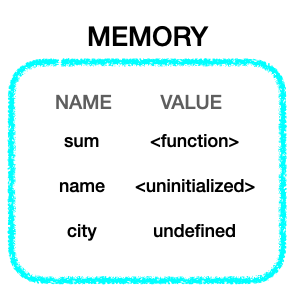

# 호이스팅

## 학습 목표

- 호이스팅이 어떤 현상인지 알아본다
- 호이스팅이 나타나는 대상을 알아본다
- 실제로 어떻게 그런 현상이 나타나게 되는지 알아본다

### 호이스팅의 정의

`호이스팅(hoisting)`이란 자바스크립트에서 함수나 변수 선언이 해당 유효 범위(스코프)의 최상단으로 끌어올려지는 _것처럼_ 보이는 현상을 비공식적으로 일컫는 말이다.

### 유효 범위(스코프)란

여기서 잠깐 유효 범위(스코프)가 무엇인지 간단하게 짚고 넘어가자면, 해당 변수가 정의되어 있는 영역을 의미한다. 다른 말로 하면 '정의된 변수를 사용할 수 있는 소스코드의 집합'으로 생각할 수 있다. 예컨대 전역 변수(global variable)의 스코프는 전역적이다. 즉, 프로그램 전체에서 그 변수를 사용할 수 있다는 뜻이다. 반면 어떤 함수 내에서 정의된 변수는 오직 그 함수의 몸체 안에서만 정의되고 사용될 수 있다. 이런 변수는 지역 변수(local variable)라고 하며 스코프도 지역적이다. 아래 예시 코드를 보자.

```javascript
var globalScope = "global"; // 어떠한 함수에도 속하지 않는 변수. 전역 변수.
function checkScope() {
  var localScope = "local"; // 함수 내에 선언된 지역 변수.
  console.log(globalScope);
  console.log(localScope);
}
checkScope(); // global local
localScope; // Uncaught ReferenceError: localScope is not defined
```

globalScope 변수는 어떠한 함수에도 속하지 않는 최상위 자바스크립트 코드이며 전역 변수이다. 위에서 언급했다시피 전역 변수의 유효 범위 또한 전역적이므로 프로그램 전체에서 사용될 수 있다. 즉 checkScope라는 함수 내에서도 globalScope 변수를 참조할 수 있다.

반면 localScope는 함수 내에서 정의되었으므로 지역 변수이고 해당 함수의 몸체 내에서만 사용될 수 있다. 그러므로 checkScope의 몸체 바깥에서 localScope를 참조하려고 하면 해당 변수가 정의되지 않았다는 reference error가 나게 된다.

### 호이스팅의 예시

```javascript
var scope = "global";
function f() {
  console.log(scope);
  var scope = "local";
  console.log(scope);
}
```

위 코드에서 함수 f를 호출하면 콘솔에는 어떤 로그가 찍힐까? 찍어보면 첫 번째는 undefined, 두 번째는 local을 로그하는 것을 볼 수 있다.

_위에서 스코프를 설명하면서 전역 변수의 유효 범위는 전역적이므로 함수 내에서도 참조할 수 있다고 했는데, 왜 첫 번째 로그는 global이 아니고 undefined인 걸까?_

이는 스코프 규칙 때문인데, **함수 내에서는 지역 변수가 전역 변수에 우선하기 때문이다.** 이는 스코프 체인(scope chain)이라는 개념과도 관련이 있는데, scope라는 변수의 값을 얻고자 할 때 우선적으로 해당 함수 몸체 내부에 scope가 정의되어 있는지 살핀다는 뜻이다. 만약 함수 내부에 없다면 그 다음에 함수 바깥을 탐색한다.

그렇다면 함수 내부에 과연 scope 변수가 정의되어 있을까? 결과가 global이 아닌 undefined가 찍힌 것을 보면 함수 내에서 scope 변수를 찾을 수 있다는 말이다. (함수 몸체 내부에 없었다면 전역 변수인 scope의 값을 가져다 로그했을테니 말이다)

그런데 함수 내부에서 지역 변수인 scope를 찾긴 찾았는데 그 값인 local을 로그하지 않고 undefined를 로그했다. 이것이 호이스팅 현상이다.

```javascript
var scope = "global";
function f() {
  var scope;
  console.log(scope);
  scope = "local";
  console.log(scope);
}
```

호이스팅에 정의에서, 호이스팅이란 함수나 변수의 선언이 해당 유효 범위의 최상단으로 끌어올려지는 것처럼 보이는 것이라고 했다. 즉, 지역 변수인 scope의 선언이 지역 스코프의 최상단 즉 함수 몸체의 맨 위로 끌어올려지고, 나중에 local이라는 값을 할당하는 것처럼 된다. (선언만 끌어올려질 뿐 할당까지 끌어올리진 않는다) 따라서 첫 번째 로그가 찍히는 시점에서 scope라는 지역 변수가 존재하기는 하지만 변수의 값이 undefined인 상태가 되는 것이다.

### 호이스팅의 대상

모든 함수와 변수 선언에 호이스팅 현상이 나타나는 것은 아니다. 함수에서는 선언문이, 변수에서는 var 키워드로 선언한 변수만이 호이스팅 현상을 보인다.

```javascript
// 함수 선언식 - 호이스팅 대상
function square() {
  return x * x;
}
// 함수 표현식 - 호이스팅 대상 아님
var square = function (x) {
  return x * x;
};
```

함수 선언문이 실제로 하는 일은 어떤 변수를 정의하고 함수 객체를 그 변수에 할당하는 것이다. 반면 함수 표현식은 변수를 정의하지 않는다. 정의된 함수를 변수에 할당할 뿐이므로 표현식 함수는 변수에 할당되기 전까지 참조할 수 없다. (**변수 선언은 끌어올려지지만 변수 할당은 그렇지 않다**)

### 호이스팅 현상이 실제로 일어나는 과정

위에서 호이스팅을 정의할 때, 함수나 변수 선언이 끌어올려지는 **것처럼** 보인다고 말했다. 즉 이것은 그렇게 보이는 현상이지 실제로 그렇게 작동하는 것은 아니다. 왜 이런 현상이 나타나는지 알아보자.

자바스크립트 엔진은 코드를 인터프리팅하기 직전에 컴파일레이션(compilation) 과정을 거친다. 컴파일레이션은 크게 Tokenizing -> AST Parsing -> 코드 생성의 과정으로 나타낼 수 있는데, 이 코드 생성 단계에서 변수를 생성하고 메모리에 저장하는 등의 일을 한다.

이 때 var 키워드로 선언된 변수나 선언식 함수가 어떻게 메모리에 저장되는 지 알아보자.

```javascript
console.log(sum(2, 3)); // 5
console.log(city); // undefined
console.log(name); // refernce error

function sum(x, y) {
  return x + y;
}

const name = "Leo";

var city = "Suwon";
```

선언식 함수는 함수가 선언될 때 sum이라는 이름과 전체 함수에 대한 참조와 함께 저장된다. const로 선언된 변수 name은 uninitialized 로 저장된다. var로 선언된 변수 city는 undefined로 값이 저장된다.



이렇게 메모리에 변수 생성 및 저장이 끝나고 엔진이 코드를 실제로 실행하기 시작한다. 첫 번째 줄에서는 메모리에 sum 함수 전체에 대한 참조와 함께 저장되어 있는 상태이므로 첫 번째 줄에서 5를 로그한다. 두 번째 줄에서 city라는 변수는 undefined 값으로 저장되어 있으므로 undefined를 로그한다. 세 번째 줄에서는 name 변수가 uninitialized로 저장되어 있는데, 여기에 접근하려고 하면 reference error가 난다. 나중에 `const name = "Leo"` 라는 줄을 실행할 때에 비로소 메모리에 Leo라는 값이 overwrite되며 그 때부터 name 변수의 값에 접근이 가능해지는 것이다.

## Self Check

- 호이스팅이란 무엇인지 설명하시오
- 호이스팅의 대상이 되는 함수와 변수에 대해 설명하시오
- 호이스팅이 왜 나타나게 되는지 설명하시오

## Ref

- 자바스크립트 완벽 가이드
- You don't know JS
- [https://dev.to/lydiahallie/javascript-visualized-hoisting-478h](https://dev.to/lydiahallie/javascript-visualized-hoisting-478h)
